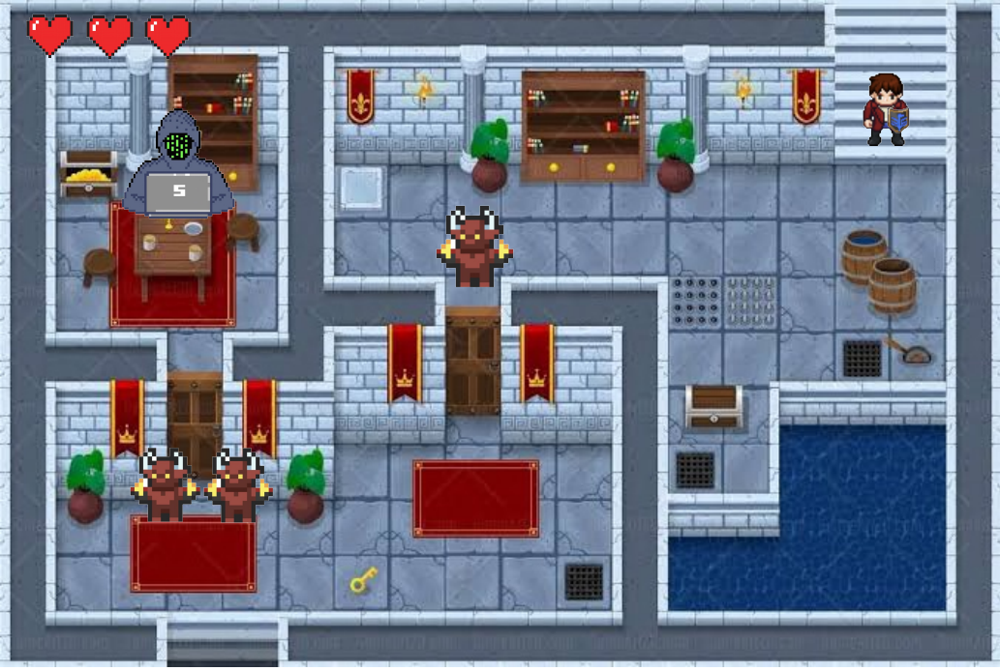
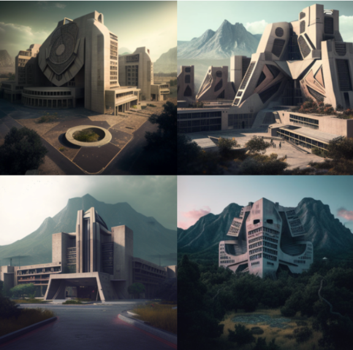

# **War of the Gods - An RPG Game**

## _Game Design Document_

---

##### ** Group 6 - Luis Rico, Joaquin Saldarriaga, David Vieyra, Natalia Maya, and Miguel Cabrera **

##
## _Index_

---

1. [Index](#index)
2. [Glossary](#glossary)
3. [Game Design](#game-design)
    1. [Summary](#summary)
    2. [Gameplay](#gameplay)
    3. [Mindset](#mindset)
    4. [Requirements and Rules](#resandrules)
4. [Technical](#technical)
    1. [Screens](#screens)
    2. [Controls](#controls)
    3. [Mechanics](#mechanics)
5. [Level Design](#level-design)
    1. [Themes](#themes)
        1. Ambience
        2. Objects
            1. Ambient
            2. Interactive
        3. Challenges
    2. [Game Flow](#game-flow)
6. [Development](#development)
    1. [Abstract Classes](#abstract-classes--components)
    2. [Derived Classes](#derived-classes--component-compositions)
7. [Graphics](#graphics)
    1. [Style Attributes](#style-attributes)
    2. [Graphics Needed](#graphics-needed)
8. [Sounds/Music](#soundsmusic)
    1. [Style Attributes](#style-attributes-1)
    2. [Sounds Needed](#sounds-needed)
    3. [Music Needed](#music-needed)
9. [Schedule](#schedule)

## _Glossary_ 

---

Before delving into the conceptualization and definition of this RPG videogame, its components and characters as well, in order to fully understand it a few key concepts must be defined:

* **Software** - Term referring to the programs and data on a laptop, that operate the devices in it.

* **GDD** - Acronym for “**G**ame **D**esign **D**ocument”; It is a document in which the requirements and functions that the video game described must comply with are defined.

* **RPG** - **R**ole **P**laying **G**ame; it's a type of game that allows you to take on the role of a fictional character in an imaginary world, make decisions about how you want that character to change, and progress through a story or series of quests; while facing challenges and improving your gamer skills.

* **Requirements** - They define what the software to be developed should do, and how. There are these types:

    * **Functional** - These describe the _behavior_ of the software, under some frameworks. They always carry a _verb_; like “check date and time”.

    * **Non-functional** - These describe properties or characteristics that the software should have; they can also encompass some of the Functional ones.

    * **Restrictions** - These are factors that define the limitations of how the developer will work; whether they are costs, which include salaries and payments to be made during work time, as well as services to be used, such as Cloud or Database storage.

* System Model (UML) - The UML is a so-called “_standardized language modeling_”; it allows developers to visualize, build and document software development (miro.com, s/f).

## _Game Design_

---

### **Summary**

The game is set in a fantasy version of the CSF campus of Tec de Monterrey. The main character, one of the members of work group, will have to face four different bosses, each with their respective powers, with the giudance of a _magical lamb_.

### **Gameplay**

What should the gameplay be like? What is the goal of the game, and what kind of obstacles are in the way? What tactics should the player use to overcome them?

The game will have pixeled-like interior setting designs, and character ones as well; yet the _outer_ part of the game environment will not: [poner imágenes]

As it was mentioned, the game will have six main characters to choose from: 

1. **Luis**.

2. **David**.

3. **Natalia**.

4. **Jose**.

5. **Miguel**.

6. **Joaquin**.

These will be the characters:

And this is how they'll look when you select one of them:

Whoever the player chooses, will be guided by _Borret_; the magical lamb:

Borret (in the map):

Borret (when you speak to him):

He will show you four different powers to choose from:

1. **'Water'** element
2. **'Fire'** element
3. **'Plant'** element
4. **'Air'** element

**All elements, all at once:**

With which you can start the game and subsequently fight these four bosses:

1. **Gileus** - Throws 'X', 'O', '◻', and '△' symbols at the player's character. His weakness is batteries 🔋; which you will throw at him.

2. **Octerminiti** - Thwors '$:' and 'C:\' symbols. His weakness are 'Alt-F4's, which you will throw at him.

3. **SeQueLus** - Throws 'primary' and 'secondary' keys at the character. His weakness are 'NULL' values; which the player's character will throw at him.

4. **Spordus** - Throws failed codes at the character. his weakness is _water_, so the player's character will throw water buckets at him.

The main goal is to defeat them; the last one being the hardest to fight. Each clash taking place in a different spooky magic castle; with different colors and features. It must be mentioned that the main character will have to know the waknesses of the bosses _before_ facing them off. 

In addition, each boss will have his henchman: 

1. **Gileus: Beria** - His weakness is the 'fire' element.

2. **Octerminiti: Astaroth** - His weakness is the 'air' element.

3. **SeQueLus: Le Oraculo** - His weakness is the 'plant' element.

4. **Spordus: Valefar** - His weakness is the 'water' element.

Note that the weaknesses of these henchmen are the _power elements_ that Borret will give the player to choose from at first; in such a way that, depending on the element that the player chooses, one of these will be easier to defeat than the others.

### **Mindset**

As a fantasy RPG game, we want the palyer to have a mindset of wanting to go on a magical adventure, with references to things like databases and game consoles; and if the player knows the _real_ campus, they'll know that each magical castle is itself one of its class buildings.

We want the player to feel like they literally have the fate of the main character in their hands; so the latter will have to choose wisely each magic power, gems and the order of the clashes against the first three bosses.

### **User Stories**

* **Gilberto:**
    * The game must have several _game profiles_, and log in with them.
    * The user must be able to play the game during a "session", and the game to to store the latter's progress in it.
    * The game must have its own website; in which you'd be able to to review statistics on game information, that allow the user to devise better strategies.
    
* **Octavio:** “_The project is made up of 4 main parts: the game itself (Unity), its website, its databases (D.B.s), and the connection between them._”
    * **Web page:**
        * It is expected that the group will develop a webpage that shows the general information of the game.
        * The game must be running on the website, and there must be another one that shows the game data that was collected via graphs.
    * **Databases:**
        * Basic data must be registered for the game to work; as well as the data that is stored as the player progresses in the game.
    * **Videogame:**
        * It is expected to be an RPG.
        * With a _game mechanic_ that encourages strategic decision-making
        * Part of the data that has to be stored (in the D.B.s) has to do with those decisions that are being made.
    * **Connection between these:**
        * APIs must be designed to be the means of communication between the three parts of the project.

* **Esteban:** “_As a client, I would like to have the information. distributed in tables; No missing or duplicate data._” Columns: D.B., Web design, Videogame design.
    * **Functional Requirement -** Save player name, powers... and data type. The data to store, and the type.
    * Since you know what data exists, create an Entity-Relationship model. in which a "3rd normal form" is made. The Model must be created with UML. At first, you do not have to create the tables, but you do have to be clear about the conceptual definitions.
    * With the Model done, create the tables in MySQL with code. Adding integrity constraints (like primary keys).
    * Fill these tables with info. generic "_dummy_" data to test them, and get an idea. So, what follows is to start defining the front/back-end queries.
    * **Conceptual model -** Those programs and data on a laptop, which operate the devices.
* **Training partner:**

    "Personally, my approach is more towards the user experience part, that is, that your game is something that "is fun to play" and that "provides a challenge to the player as well as validating their decisions and having some effect on their experience" in addition to being something that can be 'replayable, that is, that my first time playing can be different from the second based on my decisions'. "
    
    " If I had to say something about databases, I suggest you save files, since having replayability allows you to save various states of the game and my decisions to continue later. On the web design side, that on your page I can understand what your game is about, that you sell me the idea and possibly a '_how to play_' would be good in case the game is somewhat complex."

### **Requirements and Rules**

For the development of this videogame, all the _requirements_ for the job were divided into the following types: _functional_, _non-functional_ and _restrictions_. Here are some of them:

**Functional requirements**
* General System - The game will have its own webpage; in which the user will be able to see the game's statistics.
    * The game must be embedded in the website, with a _user manual_.
* The game _itself_ is a functional requirement; as is defining its aspects: 
    * Web design (HTML/MarkDown, CSS)
    * Data Bases (SQL)
    * Videogame design (Unity)
* The different tables of the Databases will be:
    * Bosses (Attributes)
    * Player Character (Attributes)
    * Scenarios (Attributes)
    * Match scores
* There will be a 'save progress' and checkpoints, which will be registered in one same database (F.)
* There will be a user registration system. (players)
* Each character will have its own 'sprites'.

**Non-functional requirements**
* The user interfaces will be:
    * 'Main menu' screen
    * 'Pause' screen
* Animations; music and sound effects.
* The game's concept art will be based on the Santa Fe campus.
* For the _character customization_, there'll be four powers to choose from at the beginning of the game
* The playable characters will be all six members of the group; but the player will only be able to choose one.
* Define a "Game user manual".
* Eventually, every group member will have to learn how to use the 'Unity' software correctly   

**Restrictions**
* Time to finish the defined videogame: 10 weeks
* Budget: $0 pesos
* Human resources: a team of 6 people
* Skills of group members
* Final delivery date: approximately, early May
* Work rate: One sprint per week
* Game genre: **RPG** (**R**ole **P**laying **G**ame)

**Rules**

In this section, the _rules_, and _mechanics_, of the game will be discussed. These are the defined rules:

1. To progress through the Classrooms, the player must solve the level's puzzles and defeat the final boss and his minions each level without losing all their lives. Each level will be more difficult than the previous one.
2. The player will only have 4 lives per level.
3. At the beginning of the game the player can only carry one weapon. As the player progresses, they will gain different tools and abilities. He will only be able to carry a sword, special ability, and a shield. So you will have to wisely choose his inventory to beat the level.
4. In the levels there will be hidden gems that will give the hero a power for 10 seconds or an extra life in the case of acquiring the red gem.
5. There will be a type of NPC (sort of "quest givers"); who will appear before each level, and will propose a challenge to the player, in exchange for a special item (sword or shield).

On the other hand, the _mechanics_ of the game are defined in the 'Technical' section of this document!

## _Technical_ [TERMINAR PARA PROXIMA ENTREGA]

---

### **Screens**

1. Title Screen
    1. Options
2. Level Select and Screens

    0. **Level Select screen:**

    1. Introductory scene (it's Borret time):

        

    2. Level One
        
        

    3. Level Two
        
        

    4. Level Three

        

    5. Level Four

    

3. Game
    1. Inventory
    2. Assessment / Next Level
4. End Credits

### **Controls**

How will the player interact with the game? Will they be able to choose the controls? What kind of in-game events are they going to be able to trigger, and how? (e.g. pressing buttons, opening doors, etc.)

### **Mechanics**

Regarding the 'game controls', these _mechanics_ are:
* The player can make the character move with  the following keys:
    * 'W' to go upwards/ahead.
    * 'A' to move to the left.
    * 'S' to move backwards.
    * 'D' to move to the right.
* The playable character can crouch (agachar)  with the 'SHIFT' key.
* To interact with other characters (like Borret), doors, buttons, and chests, the player will use the 'E' key.
* With the 'left-click', the main attack will be with the sword; whereas with the 'right-click' he'll use his shield to defend himself from attacks.
* With the keys 'Z', 'X' and 'C', the _special abilities_ will be used.

## _Level Design_

---

### **Game Flow**

**The game will start with a 'front' view style.**

1. Player starts outside the Campus; finds Borret waiting for the latter's arrival and explains the adventure ahead. Borret will give the character a gem of its choice.

**From this moment, the game view will be 'platform' style.**

2. Player heads to the Building 1 (for the next submission we must think of a better name). There, it will first encounter with Beria, try to fight it with the chosen gem's powers.
3. Afterwards, the player will fight the first Boss: Gileus.
4. If the player defeats him, the player will be able to head to Building 2; where the latter will fight the henchman Astaroth and later the boss Octerminiti.
5. If the player defeats both of them, the player will head to Building 3; will fight the henchman Le Oraculo and the boss SeQueLus.
6. If the player defeats them, will head to Building 4 and will fight the henchman Valefar and the boss Spordus.
7. At the end, the player will find Borret waiting at the Campus' main door; will thank the player for its help.

### **Combat**
The combat will be based on a style of attack and defense, there will be no turns, there will be tools with which the player can defend himself against the attacks of the enemies, covering or dodging before the attack generates damage on him, while the attack will be focusing on the enemy and then attacking him (Similar to the type of combat in zelda or Grand Theft Auto
[Melee Combat]).

Regarding the boss fight, the combat will be similar to the combat system of the game in general with the difference that the bosses will have certain weaknesses which were explained previously. These weaknesses will enter the fight as a way to generate more damage to the boss.

### _Note_
Each of the encounters with the main bosses will be in different parts of the campus, once each boss is defeated a new area will be unlocked where the player will face a new boss, meanwhile these areas will be made up of collection items and enemies according to the boss that is in that area, once the area is explored and after defeating the minions, the battle with the boss will take place.

## _Development_

---

### **Abstract Classes / Components**

1. **Characters** - The derived classes will be 'mainCharacter', 'villains', and 'henchmen'.
2. **Helper** Its only object will be 'Borret'.
3. **ItemsGeneral** - The derived classes will be 'gems', 'tools', 'armor' and 'powers'.

### **Derived Classes / Component Compositions**

1. **Characters**
    * **mainCharacter**
        * Attributes - characterName, characterHealth (4), characterAtaque, selectedPower (powers - Items), characterSpeed, characterOutfitColors.
        * Methods - setcharacterHealth(int characterHealth), getcharacterHealth(), setcharacterName(string characterName), getcharacterName(), setCharacterAtaque(characterAtaque), getCharacterAtaque(), setSelectedPower(selectedPower), getSelectedPower(), setCharacterSpeed(int Speed), getCharacterSpeed(), setOutfitColors(OutfitColors), getOutfitColors(), moveUp('w', positions), moveDown('s' positions), moveRight('d' positions), moveLeft('a' positions), looseHealth(characterHealth).
    * **Villains**
        * Attributes - villainName, villainsHeadColor, villainsWeapon (Item), villainsHealth.
        * Methods - setVillainsHealth(int villainsHealth), getVillainsHealth(), setVillainName(string villainName), getVillainName(), looseHealth(health), setVillainWeapon(villainWeapon), getVillainWeapon(), setVillainsHealth(int villainsHealth), getVillainsHealth(), attack(itemUsed, damage), 
    * **Henchmen**
        * Attributes - henchmenName, bossCharacter (Villain), henchmenHealth, henchmenAttack, damageDone, enemyType, .
        * Methods - setHealth(int henchmenHealth), getHealth(), setHenchManHealth(HenchManHealth), getHenchManHealth(), setDamageDone(int damageDone), getDamageDone(), setEnemyType(enemyType), getEnemyType(), setName(string henchmenName), getName(), attack(damageDone), weaknessApplied(weakness, powerThworn, health).
2.  **Helper (Borret)**
    * Attributes - helperName, helperHeight (?), lengthSpeech.
    * Methods  - setHeight(int Height), getHeight(), setName(string Name), getName(), sayDialogue(lengthSpeech, mainCharacter.name), setLengthSpeech(int lengthSpeech), getLengthSpeech().

3. **ItemsGeneral**
    * **Gems**
        * Attributes - gemName, gemType, gemColor, specialPowers, healthGiven.
        * Methods - getGemName(), setGemName(string gemName), setGemType(gemType), getGemType(), setSpecialPowers(SpecialPowers), getSpecialPowers(), getGema(mainCharacter.name), regenerateHealth(numero, mainChar. - characterHealth).
    * **Items**
        * Attributes - itemName, itemType, itemColor, .
        * Methods - getItemName(); setItemName(string itemName); getItemType(); setItemType(string itemType); getItem(character - characterName, itemName).
    * **Powers**
        * Attributes - powerName, powerType, damageDone, strength, weakness.
        * Methods - setPowerName(string powerName), getPowerName(), setPowerType(powerType), getPowerType(), setDamageDone(int damageDone), getDamageDone(), setStrength(int Strength), getStrength(), setWaekness(int waekness), getWaekness(), selectPower(mainCharacter.name, typePower), causeWeakness(character, gem, boss).
    * **Armor**
        * Attributes - armorName, armorType, armorColor, armorBlade (yes/no), armorShield (yes/no).
        * Methods - setArmorName(string armorName), getArmorName(), setArmorType(armorType), getArmorType(), setArmorColor(string armorColor), getArmorColor(), isItBlade(bool blade), isItShield(bool shield) bladeTaken(type, mainCharacter.name), shieldTaken(type, mainCharacter.name),weaponNewOwner(type, mainCharacter.name).

## **UML Class Diagrams**

**Diagram 1** - UML Class diagram for the class 'Character' and it derived ones:

**Diagram 2** - UML Class diagram for the class 'Helper':

**Diagram 3** - UML Class diagram for the class 'ItemsGeneral' and its derived ones:

Apart from the main, and derived, classes previously defined it must be mentioned that our "project managers" (Gilberto, Esteban and Octavio) suggested that, instead of the derived class 'mainCharacter' having the methods to move (_up_, _down_, _left_ and _right_), a new _script_ should be developed apart that had these methods to move. It would also invoke the objects that would _move_ in such ways; as that of the player. We would define a new class called "_movement_", and would assign it and its code to the objects in Unity.

## _Graphics_

---

### **Scenarios**

As it has been previously mentioned, the game will be set on a fantasy-type campus; some names options could be:
* Campsia
* Santafia
* Tecbyte
* ForgeByte
* SQueLA

### **Style Attributes**

What kinds of colors will you be using? Do you have a limited palette to work with? A post-processed HSV map/image? Consistency is key for immersion.

What kind of graphic style are you going for? Cartoony? Pixel-y? Cute? How, specifically? Solid, thick outlines with flat hues? Non-black outlines with limited tints/shades? Emphasize smooth curvatures over sharp angles? Describe a set of general rules depicting your style here.

Well-designed feedback, both good (e.g. leveling up) and bad (e.g. being hit), are great for teaching the player how to play through trial and error, instead of scripting a lengthy tutorial. What kind of visual feedback are you going to use to let the player know they&#39;re interacting with something? That they \*can\* interact with something?

### **Graphics Needed**

1. Characters
    1. Joaquin
        1. Name - Joaquin
        2. Playable - Yes
        3. Health - 4
        4. Speed - 2
        5. Description - "A hero with a heart of gold and a sharp mind". (I've heard different from them but okaaay)
        
    2. Bebo
        1. Name - Bebo
        2. Playable - Yes
        3. Health - 4
        4. Speed - 2
        5. Description - "A brave and loyal warrior, willing to fight for his people."

    3. David
        1. Name - David
        2. Playable - Yes
        3. Health - 4
        4. Speed - 2
        5. Description - "A brave and loyal warrior who is always willing to put his life on the line for his friends."

    4. Nat
        1. Name - Nat
        2. Playable - Yes
        3. Health - 4
        4. Speed - 2
        5. Description - "A bright and talented student, who always has an ace up her sleeve."

    5. Daniel
        1. Name - Daniel
        2. Playable - Yes
        3. Health - 4
        4. Speed - 2
        5. Description - "A brave and cunning student who always has a plan B or not."

    6. Miguel
        1. Name - Miguel
        2. Playable - Yes
        3. Health - 4
        4. Speed - 2
        5. Description - "A strong and determined hero, who never gives up in the face of adversity."

    These are all the playable characters, all at once:
    

    All the NPCs:

    1. Borret
        1. Name - Borret
        2. Playable - No
        3. Health - 1000
        4. Speed - 0
        5. Description - "A wise and mysterious being who possesses a penetrating gaze; capable of seeing beyond what others can"

    This is Borret:
    

    2. Beria
        1. Name - Beria
        2. Playable - No
        3. Health - 4
        4. Speed - 2
        5. Description - "Beria, the vegetable terror, stands before our hero with his twisted head and his body entangled in poisonous thorns"

    This is Beria:
    

    3. Velafar
        1. Name - Velafar
        2. Playable - No
        3. Health - 4
        4. Speed - 2
        5. Description - "Beria, the vegetable terror, stands before our hero with his twisted head and his body entangled in poisonous thorns"

    This is Valefar:
    

    4. Astaroth
        1. Name - Astaroth
        2. Playable - No
        3. Health - 16
        4. Speed - 4
        5. Description - "The specter of darkness, silently glides before our hero with his ethereal body and shadowy presence."

    This is Astaroth:
    

    5. Le Oracle
        1. Name - Le Oracle
        2. Playable - No
        3. Health - 8
        4. Speed - 1
        5. Description - "The doom machine stands in the way of our hero with his mechanical appearance and crimson eyes glowing like fire."

    This is Le Oracle:
    

    6. Green Velafar
        1. Name - Green Velafar
        2. Playable - No
        3. Health - 8
        4. Speed - 2
        5. Description - "This guy, Valefar's green variant the infernal spawn pounces on our hero with his tiny body and his fiery gaze."

    This is Green Valefar:
    

    7. Gileus
        1. Name - Gileus
        2. Playable - No
        3. Health - 2
        4. Speed - 2
        5. Description - "Gileus, the king of video games, stands before our hero with his video game console control head."

    This is Green Valefar:
    
    
    8. Octerminiti
        1. Name - Octerminiti
        2. Playable - No
        3. Health - 4
        4. Speed - 4
        5. Description - "Octerminiti, the master of programming, stands before our hero with his dark, ghostly body and cmd terminal head."

    This is Green Valefar:
    

    9. SeQueLus
        1. Name - SeQueLus
        2. Playable - No
        3. Health - 16
        4. Speed - 2
        5. Description - "SeQueLus, the golden tyrant, stands before our hero in his gleaming armor and cylindrical database-like head."

    This is Green Valefar:
    

    10. Spordus
        1. Name - Spordus
        2. Playable - No
        3. Health - 1000
        4. Speed - 0
        5. Description - "The code master, stands before our hero with his laptop in hand and his dark head made of binary code."

    This is Green Valefar:
    

2. Tools
    1. Basic-level sword
    2. Borret's amulet shield
    3. Sword of Light

3. Gems
    1. Blue: Strength

    
    
    2. White: Stamina

    
    
    3. Yellow: Speed
    
    
    
    4. Red: Boosts your life

    
    
    5. Other Gems:

    

**All the gems, all at once:**

4. Armor
    1. Front.
        * Power - Leather
        * Description - x2 Resistance
        * Term/duration - NULL

    

    2. Front.
        * Power - Silver
        * Description - x4 Resistance
        * Term/duration - NULL

    

    3. Cape.
        * Power - Red
        * Description - x3 Velocity
        * Term/duration - NULL

    

    4. Shield.
        * Power - Magic Blue
        * Description - x3 Resistance
        * Term/duration - NULL

    

    5. Magic pants.
        * Power - Gold
        * Description - x3 Resistance
        * Term/duration - NULL

    

5. Weapon

6. Other (soon-to-be defined...)
    1. ?

## _Sounds/Music_

---

### **Style Attributes**

Again, consistency is key. Define that consistency here. What kind of instruments do you want to use in your music? Any particular tempo, key? Influences, genre? Mood?

Stylistically, what kind of sound effects are you looking for? Do you want to exaggerate actions with lengthy, cartoony sounds (e.g. mario&#39;s jump), or use just enough to let the player know something happened (e.g. mega man&#39;s landing)? Going for realism? You can use the music style as a bit of a reference too.

 Remember, auditory feedback should stand out from the music and other sound effects so the player hears it well. Volume, panning, and frequency/pitch are all important aspects to consider in both music _and_ sounds - so plan accordingly!

### **Sounds Needed**

1. Effects
    1. Soft Footsteps (dirt floor)
    2. Sharper Footsteps (stone floor)
    3. Soft Landing (low vertical velocity)
    4. Hard Landing (high vertical velocity)
    5. Glass Breaking
    6. Chest Opening
    7. Door Opening
2. Feedback
    1. Relieved &quot;Ahhhh!&quot; (health)
    2. Shocked &quot;Ooomph!&quot; (attacked)
    3. Happy chime (extra life)
    4. Sad chime (died)

_(example)_

### **Music Needed**

1. Slow-paced, nerve-racking &quot;forest&quot; track
2. Exciting &quot;castle&quot; track
3. Creepy, slow &quot;dungeon&quot; track
4. Happy ending credits track
5. Rick Astley&#39;s hit #1 single &quot;Never Gonna Give You Up&quot;

_(example)_

## _Schedule_

---

_(define the main activities and the expected dates when they should be finished. This is only a reference, and can change as the project is developed)_

1. develop base classes
    1. base entity
        1. base player
        2. base enemy
        3. base block
  2. base app state
        1. game world
        2. menu world
2. develop player and basic block classes
    1. physics / collisions
3. find some smooth controls/physics
4. develop other derived classes
    1. blocks
        1. moving
        2. falling
        3. breaking
        4. cloud
    2. enemies
        1. soldier
        2. rat
        3. etc.
5. design levels
    1. introduce motion/jumping
    2. introduce throwing
    3. mind the pacing, let the player play between lessons
6. design sounds
7. design music

_(example)_
